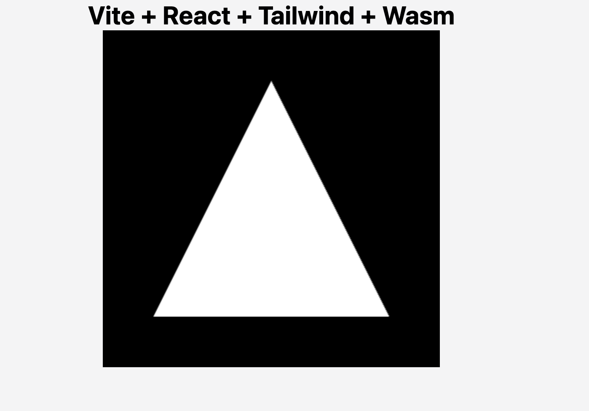

# Vite WebGL Template

Create a simple react project using vite, typescript, tailwindcss, rust, wasm, and WebGL.

## Usage:

After downloading the template and having cargo installed, go into the project file and run:

```bash
npm i
npm run wasm-build
npm run dev
```

Doing so will create the following page:

